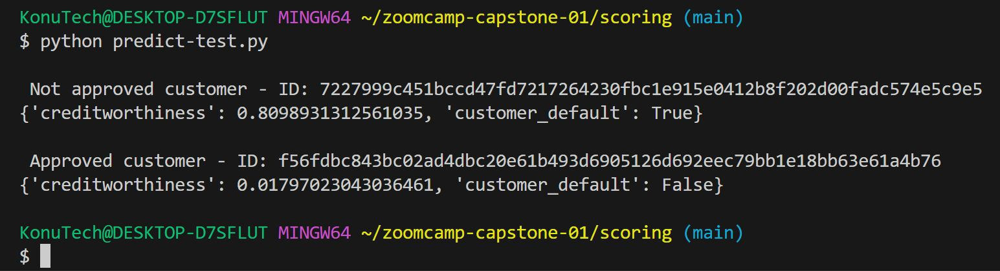

# Predict whether the customer will default

## Objective

This repository contains the midterm project for the [Machine Learning Zoomcamp](https://github.com/DataTalksClub/machine-learning-zoomcamp) course provided by [DataTalks.Club](https://datatalks.club/).

The goal of the project is to apply what we have learned during the course. This project aims to develop an exemplary, dockerized machine learning Flask service that predicts whether a customer will end up as a defaulted one.

## Dataset

The dataset used to feed the MLOps pipeline was downloaded from [Kaggle](https://www.kaggle.com/competitions/amex-default-prediction).

Reading data in chunks was applied to handle the size of the training dataset, which is approximately 16 GB, and the test set, which is around 32 GB. For a more detailed approach, please check notebooks: [01_prepare_train_data](https://github.com/KonuTech/machine-learning-zoomcamp-capstone-01/blob/main/notebooks/01_prepare_train_data.ipynb) and [05_prepare_test_data](https://github.com/KonuTech/machine-learning-zoomcamp-capstone-01/blob/main/notebooks/05_prepare_test_data.ipynb)

The datasets itself were published by American Express as part of a prediction competition with a total prize pool of $100,000.

My best submission achieved a Normalized Gini Coefficient score of 0.57895, which placed my Late Submission somewhere below the 4000th position out of more than 5000 in total. Could have done better.

For insights about the exploratory data analysis (EDA) conducted, please refer to the notebook titled: [02_eda](https://github.com/KonuTech/machine-learning-zoomcamp-capstone-01/blob/main/notebooks/02_eda.ipynb). The histograms, which have been prepared for nearly 200 columns, are saved [here](https://github.com/KonuTech/machine-learning-zoomcamp-capstone-01/tree/main/eda/histogramsb). Feel free to explore them at your convenience.

Due to the large dataset size, I decided to perform classifier training on a downsampled dataset where my binary target was resampled to have an equal distribution of 50% ones and 50% zeroes. For more insights about the downsampling process, please refer to the notebook titled: [03_downsample_data](https://github.com/KonuTech/machine-learning-zoomcamp-capstone-01/blob/main/notebooks/03_downsample_data.ipynb).

The experiments I conducted resulted in several different training runs, using Logistic Regression, RandomForest, and XGBoost algorithms. The models trained, along with logs and some artifacts, are saved [here](https://github.com/KonuTech/machine-learning-zoomcamp-capstone-01/tree/main/models). The notebook that served as my workspace for these experiments is titled [04_get_champion_binary_classifier](https://github.com/KonuTech/machine-learning-zoomcamp-capstone-01/blob/main/notebooks/04_get_champion_binary_classifier.ipynb). The final version of the training script .py is also available [here](https://github.com/KonuTech/machine-learning-zoomcamp-capstone-01/blob/main/scripts/train.py). The best iteration of XGBoost model achieved a GINI score of 0.8074 on the training set. The test predictions were submitted to Kaggle, where the Normalized Gini Coefficient scored 0.57895.

Finally, the Flask service-related scripts and artifacts are stored [here](https://github.com/KonuTech/machine-learning-zoomcamp-capstone-01/tree/main/scoring). Below, I have provided instructions on how to run the scoring process using a Dockerized setup.

Thank you for reading.

### Applied technologies

| Name | Scope |
| --- | --- |
| Jupyter Notebooks | Exploratory Data Analysis and ML Pipeline prototyping |
| Scikit-learn | RFE feature selection step, training of a Pipeline using GridSearchCV|
| XGBoost | Binary classifier |
| Flask | Web service |
| pylint | Python static code analysis |
| black | Python code formatting |
| isort | Python import sorting |

### Steps to run the scoring app

1. Clone the [machine-learning-zoomcamp-capstone-01](https://github.com/KonuTech/machine-learning-zoomcamp-capstone-01.git) repository:

    ```bash
    $ git clone https://github.com/KonuTech/machine-learning-zoomcamp-capstone-01.git
    ```

2. Install the pre-requisites necessary to run scoring app:

    ```bash
    $ pip install requrements.txt
    ```
3. Move to the scoring directory
    ```bash
    $ cd scoring/
    ```
3. Build the docker image
    ```bash
    $ docker build -t machine-learning-zoomcamp-capstone-01 .
    ```
4. Run the docker image with expose
    ```bash
    $ docker run -it --rm -p 9696:9696 --entrypoint=bash machine-learning-zoomcamp-capstone-01
    ```
5. Once image is run, start Flask service
    ```bash
    $ python predict.py
    ```
5. From the local terminal run the script which scores two exemplary customers. One should be scored as Bad, the other as Good
    ```bash
    $ cd scoring/
    $ python predict-test.py
    ```

The output shoud looks as the one on below screen shot:




------------

Project Structure
------------
    |-- data/ (directory)
        |-- parquet_partitions/ (directory)
        |-- sample_submission.csv
        |-- submission_2023-11-01_17-54-58.csv
        |-- submission_2023-11-01_20-08-34.csv
        |-- submission_2023-11-04_18-06-41.csv
        |-- submission_2023-11-05_14-54-16.bin.csv
    |-- eda/ (directory)
        |-- histograms/ (directory)
    |-- models/ (directory)
        |-- grid_search_results_2023-11-01_17-54-58.json
        |-- grid_search_results_2023-11-01_20-08-34.json
        |-- grid_search_results_2023-11-02_16-48-32.json
        |-- grid_search_results_2023-11-04_18-06-41.json
        |-- grid_search_results_2023-11-05_14-54-16.json
        |-- grid_search_results_2023-11-05_22-12-26.json
        |-- LogisticRegression_2023-11-01_17-54-58.bin
        |-- LogisticRegression_2023-11-01_20-08-34.bin
        |-- LogisticRegression_2023-11-02_16-48-32.bin
        |-- LogisticRegression_2023-11-04_18-06-41.bin
        |-- LogisticRegression_2023-11-05_14-54-16.bin
        |-- LogisticRegression_2023-11-05_22-12-26.bin
        |-- XGBoost_2023-11-01_17-54-58.bin
        |-- XGBoost_2023-11-01_20-08-34.bin
        |-- XGBoost_2023-11-02_16-48-32.bin
        |-- XGBoost_2023-11-04_18-06-41.bin
        |-- XGBoost_2023-11-05_14-54-16.bin
        |-- XGBoost_2023-11-05_22-12-26.bin
    |-- notebooks/ (directory)
        |-- 01_prepare_train_data.ipynb
        |-- 02_eda.ipynb
        |-- 03_downsample_data.ipynb
        |-- 04_get_champion_binary_classifier.ipynb
        |-- 05_prepare_test_data.ipynb
        |-- 06_score_test_data.ipynb
        |-- dict_vectorizer.pkl
        |-- exemplary_scoring_output.jpg
    |-- scoring/ (directory)
        |-- imputer.pkl
        |-- training_log.log
        |-- dict_vectorizer.pkl
        |-- Dockerfile
        |-- example_bad_customer.json
        |-- example_good_customer.json
        |-- imputer.pkl
        |-- predict-test.py
        |-- predict.py
        |-- requirements.txt
        |-- XGBoost_2023-11-05_14-54-16.bin
    |-- scripts/ (directory)
        |-- correlation.py
        |-- project_tree.py
        |-- train.py
    |-- .git/ (directory)
    |-- .gitignore
    |-- Pipfile
    |-- Pipfile.lock
    |-- project_structure.txt
    |-- README.md
    |-- requirements.txt
    |-- requirements_dev.txt
    |-- temp.txt
    |-- training_log.log

### Peer review criterias - a self assassment:
* Problem description
    * 2 points: The problem is well described and it's clear what the problem the project solves
* EDA
    * 2 points: Extensive EDA (ranges of values, missing values, analysis of target variable, feature importance analysis)
* Model training
    * 3 points: Trained multiple models and tuned their parameters.
* Exporting notebook to script
    * 1 point: The logic for training the model is exported to a separate script
* Reproducibility
    * 1 point: It's possible to re-execute the notebook and the training script without errors. The dataset is committed in the project repository or there are clear instructions on how to download the dat 
* Model deployment
    * 2 points: Model is deployed (with Flask, BentoML or a similar framework)
* Dependency and enviroment managemen
    * 2 points: Provided a file with dependencies and used virtual environment. README says how to install the dependencies and how to activate the env.
* Containerization
    * 2 points: There's code for deployment to cloud or kubernetes cluster (local or remote). There's a URL for testing - or video/screenshot of testing it.
* Cloud deployment
    * 0 points: No deployment to the cloud
